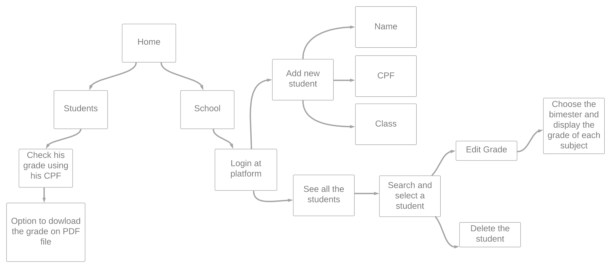

# E-grade 

>Status: Finished ✔️

### This is a project to help schools and students to verify grades.
---
## Mental Map


---
## CRUD functions 
+ Add a new student
+ Edit the student grade 
+ Delete the student
+ Search Engine to find the student
---
## Additionanal functions

+ Separete routes (Admin and Student)
+ Validate the new student added using @hapi/joi
+ The student can check his grade using his CPF 
+ Option to dowload the grades in PDF
---
## Observations 
+ Front-End part can have some problems , my focus is Back-End
+ Use npm install do dowload all the dependencies
+ You can change the NPM start to node instead nodemon
+ Don't forget to change the file (.env_example) to (.env )
+ On .env put all your variables 
---
## Technologies Used:

+ [NodeJs](https://nodejs.org/en/)
+ [EJS](https://ejs.co)
+ [MongoDB](https://docs.mongodb.com)

---
# Dependencies
```bash
  
  $ npm install @hapi/joi

  $ npm install method-override
  
  $ npm install ejs
  
  $ npm install express
  
  $ npm install dotenv
 
  $ npm install mongoose

  $ npm install nodemon

  $ npm install cookie-parser 
  
  $ npm install jsonwebtoken
  
  $ npm install cookie-parser
  
```
---
## How to test ?

To test it just use the link bellow : 

E-Grade : [https://e-grade.herokuapp.com](https://e-grade.herokuapp.com)

```
  Admin Password: adminadmin
  Student: Use the CPF number of student
```
---

<h2 align='center'>Autor</h2>
<div align='center'>
  Made with ❤️ by <a href="https://github.com/AugustoBernardes">Augusto</a>
</div>
